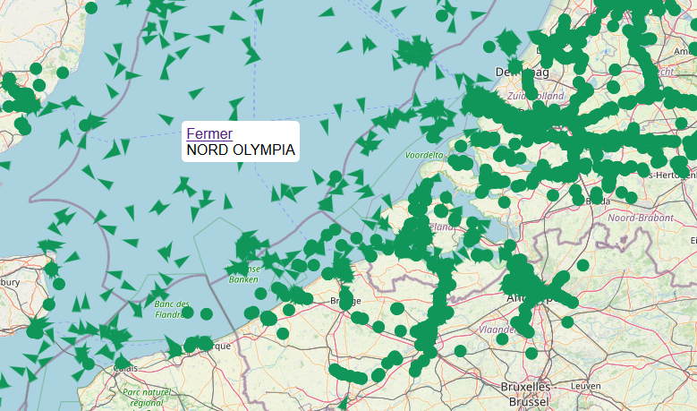
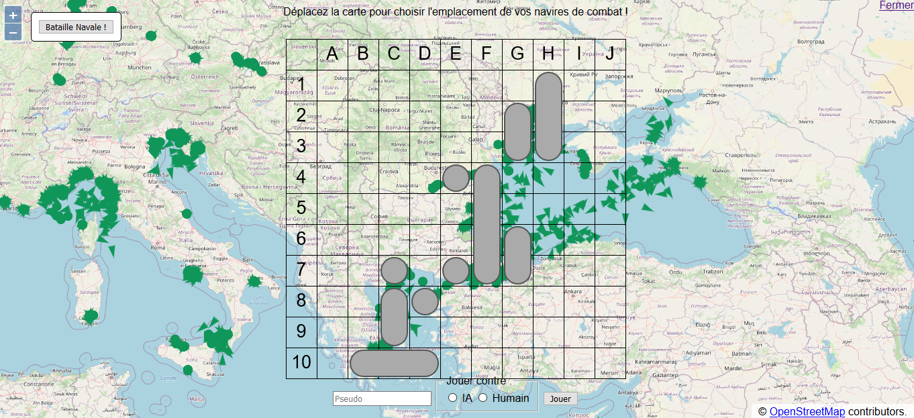

# VesselsViewer

Show vessels in the world in real-time using data from [AISHub](https://www.aishub.net) and generate a battleship game's grid using real positions.

## Screenshots




## General info

This application was developped as my assignement for the end of the Bachelor in Industrial Engineering given at [Institut Supérieur Industriel de Bruxelles](https://www.he2b.be/campus-isib)

## Features

- Server-side NodeJS/Express script to fetch data each minute so the API limitation is respected then send it to all connected clients
- Client-side application displaying a map with vessels
- A click on a vessel shows a popup with the name
- Showing a battleship game's grid with auto-generation of ships' positions
- Battleship game

## To do

- General polishing
- Multiplayer
- Optimisation

## Technologies

- Node.js 14.15.1
- Express 4.17.1
- socket.io 2.3.0
- OpenLayers 4.6.3
- Parcel 1.12.4

## Setup

You'll need Node.js and npm installed

1. Clone repository :

```bash
git clone https://github.com/rokowa/VesselsViewer.git
```

2. Install dependencies : run in the repo directory :

```bash
npm install
```

By default, the data stored in data.json are used. If you have a valid AISHub API key, you can comment the line

```javascript
'http://localhost:3000/data.json',
```

in server.js and uncomment

```javascript
// 'http://data.aishub.net/ws.php?username=<AISHub account ID>&format=1&output=json&compress=0',
```

then replace `<AISHub account ID>` by your key.

3. Build :

```bash
npm build
```

4. Start :

```bash
npm start
```

You can now access the application at http://localhost:3000/

## License

MIT License

Copyright &copy; 2020 Robin Kowalski
